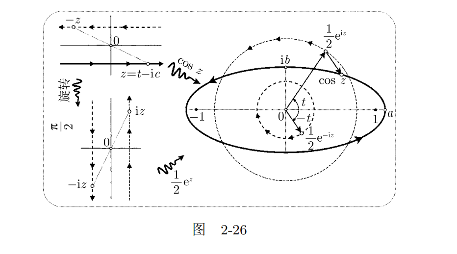

# 2.5.3 映射的几何

> $e^{i\theta}$ 表示单位圆上辐角为 $\theta$ 的一点。（p9）

$e^{it}$ 表示随着时间的变化，质点绕着单位圆做匀速圆周运动，周期为 $2\pi$

那么 $e^z = e^{c + it}$ 表示什么？

$e ^ z$ 表示质点的位置，$e ^ c$ 表示圆的半径。

 $e^z = e^{\pm(c + it)} $  

表示存在两个圆，它们的半径分别是 $e ^ {\pm c}$，且方向相反。但是角速度是一样的，都是以 $2\pi$ 为周期。

再看映射 $z \mapsto w = \cos(z)$ 中的 $z = \pm(c + it)$ 

因为 $\cos(z) = \frac{(e^{iz} + e^{-iz})}{2} $，注意这里的 $z = t - ic$，
因此 $e^{iz}$ 和 $e^{-iz}$ 表示两个圆，它们的半径分别是 $e ^ {\pm c}$，且方向相反。但是角速度是一样的，都是以 $2\pi$ 为周期。

从这里可以看到运动 $\cos z$ 是上述两个圆周运动的轨迹的合成。从图中也可以看到，任意时刻t $\cos z$ 的点所在的位置是时刻 t 两个圆周运动上对应的点对应的向量的加和。因此，$\cos z$ 的周期是也 $2\pi$。

## 为什么说  $\cos(z)$  的运动轨迹与实轴和虚轴交于 $a = \cosh(c)$ 和 $ib = i \sinh(c)$ 处（p76）？

这个问题可以转换为 $\cos(z)$ 与实轴和虚轴的交点是什么？怎么求解？

$$
\cos(z) = \frac{1}{2}(e^{iz} + e^{-iz})= \frac{1}{2}(e^{c+it} + e^{-c -it}) 
$$

当$t = 0$ 时， $\cos(z)$  的运动轨迹与实轴相交于 $\frac{1}{2} (e^c + e^{-c})$ 点，即 $\cosh(c)$；

因为$e^{i\frac{\pi}{2}} = i, e^{i(-\frac{\pi}{2})} = -i$，当$t = \frac{\pi}{2}$ 时， $\cos(z)$  的运动轨迹与虚轴相交于$\frac{1}{2} i(e^{c} - e^{-c})$ 点，即$i\sinh(c)$ 。

## 接下来看 $\cos z$ 的轨迹为什么是个椭圆？

记 $z \mapsto w = \cos(z) = u + iv$，

### 为什么 $u = a\cos(t), v = b\sin(t)$

复数 $\frac{1}{2}e^{iz} = \frac{1}{2}e^{c+it} = \frac{1}{2}e^c e^{it}$ 的实部是 $\frac{1}{2}e^c \cos t$，虚部是 $\frac{1}{2}e^c \sin t$

复数 $\frac{1}{2}e^{-iz} = \frac{1}{2}e^{-c-it} = \frac{1}{2}e^{-c} e^{-it}$ 的实部是 $\frac{1}{2}e^{-c} \cos （-t）= \frac{1}{2}e^{-c} \cos t $，虚部是 $\frac{1}{2}e^{-c} \sin (-t) = - \frac{1}{2} e^{-c} \sin t$

$z$ 的实部，$u = \frac{1}{2}e^c \cos t + \frac{1}{2}e^{-c} \cos t = \cosh c \cos t = a \cos t$

$z$ 的虚部，$v = \frac{1}{2}e^c \sin t - \frac{1}{2}e^{-c} \sin t = \frac{e^c - e^{-c}}{2} \sin t = \sinh c \sin t = b \sin t$

由上面得到 $(\frac{u}{a})^2 + (\frac{v}{b})^2 = (\sin t)^ 2 + (\cos t)^ 2 = 1$

这正是我们熟知的椭圆的参数式(p76)

### 椭圆的焦点是什么？

